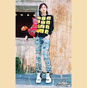
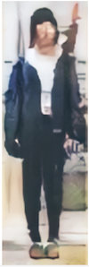

## Data Pre-processing

Use SimpleCV

### Process

1. [Catoon-ify Image](https://github.com/DongjunLee/TIL-MAL/blob/master/Image%20Processing/catoon-ify.md)
2. Scale Image 128x128
3. Data Augmentation

### Example.

#### For DCGAN Training.

  
DCGAN 모델을 Training 하기위한 이미지.

#### For Image Analysis.

  
DCGAN을 통해서 생성되는 이미지.

  
원본

dilate -> erode  

  
median x 15 -> bilateral x 30 -> dilate -> erode
